# Tokyo6DisBot

DiscordでCeVIO AI小樽組によるテキスト読み上げを行うbotプログラムです。

## 動作環境

.NET、CsVIO AI、そして小春六花トークボイス、夏色花梨トークボイスのいずれかのインストールされたPCが必要です。 CeVIO AIがインストールされたPC上でBotプログラムを走らせます。

## 導入方法

### Botの作成

まずはBotを作成します。

DiscordのDeveloper Portal(https://discord.com/developers/applications)にアクセスし、「New Application」を選択します。

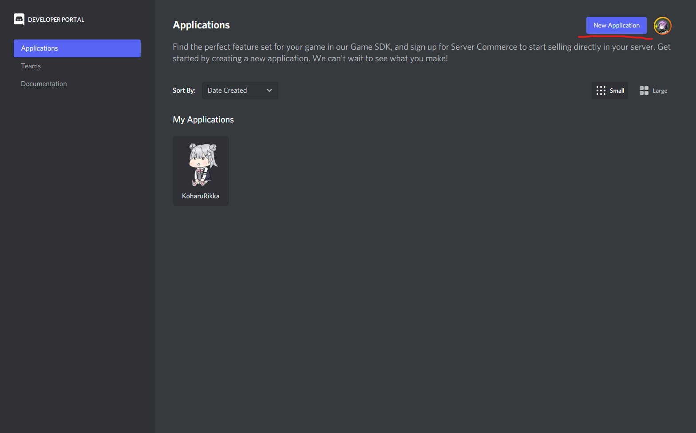

名前をつけて「Create」します。

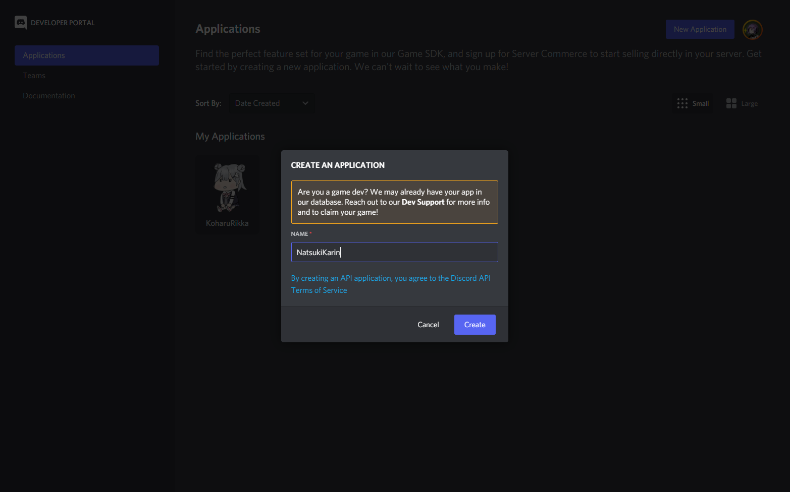

アイコンと名前を設定します。

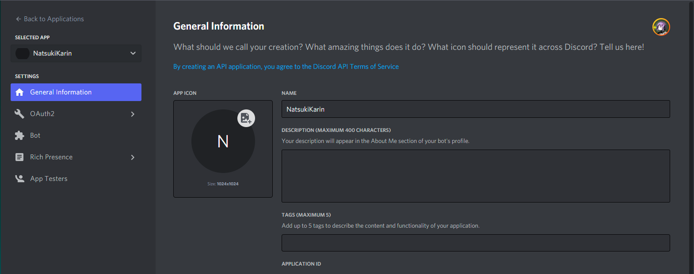
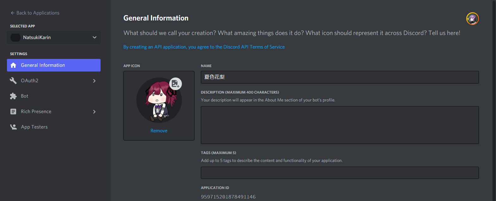

「Bot」から「Add Bot」を選択し「Yes」を選択します。

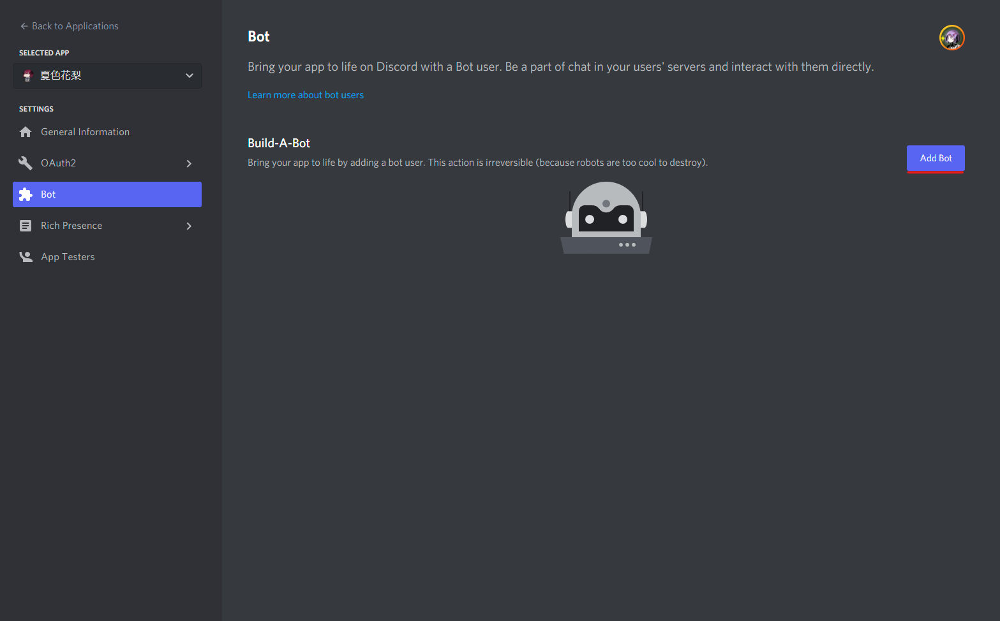
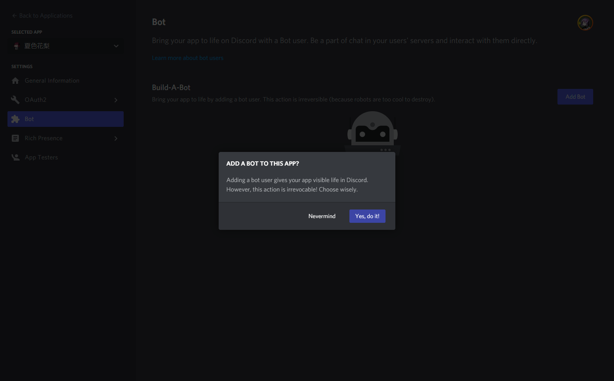

「Public Bot」のチェックを外しておきます。

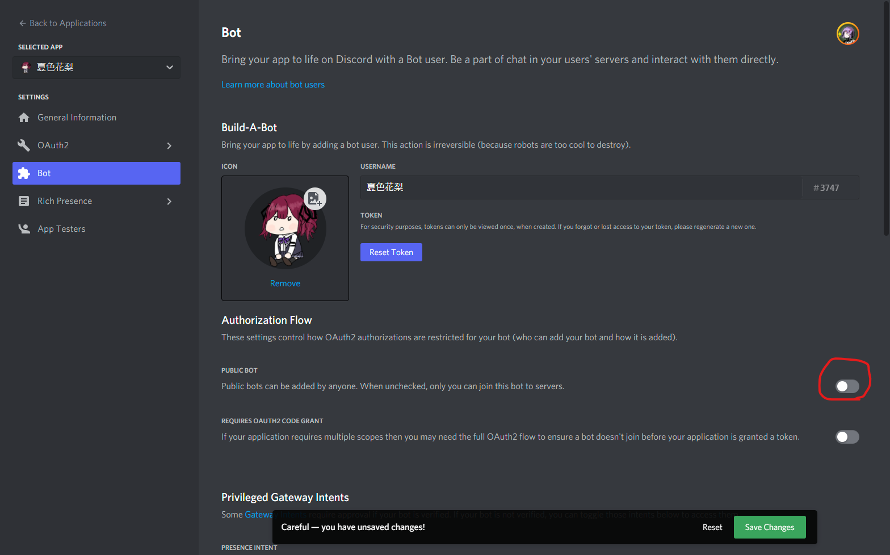

### Botをサーバーに追加する

「OAuth2」を選択し「URL Generator」を選択します。

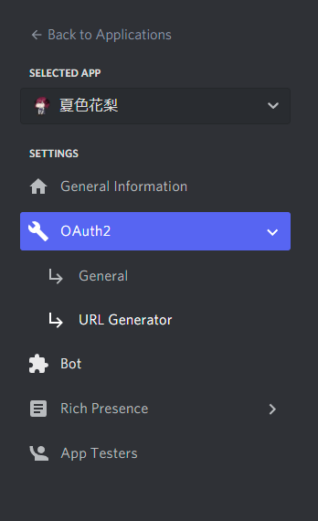

SCOPESを「bot」として、BOT PERMISSIONSに「Send Messages」「Connect」「Speak」を選択し、ページ下部のURLをコピーします。

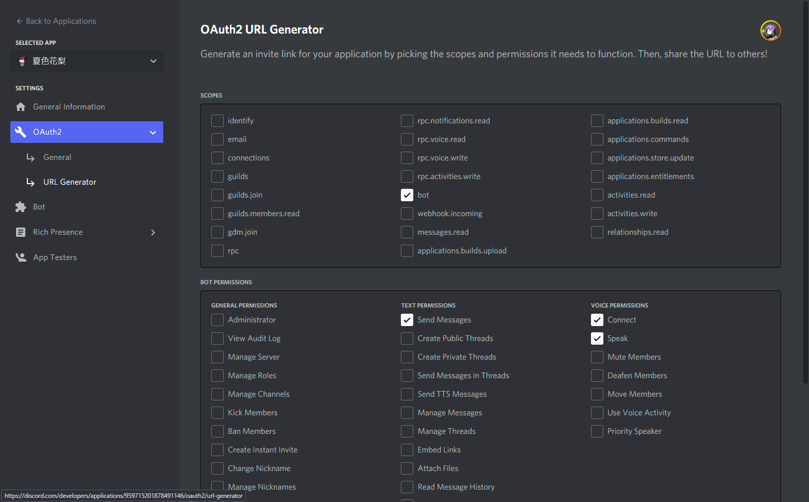
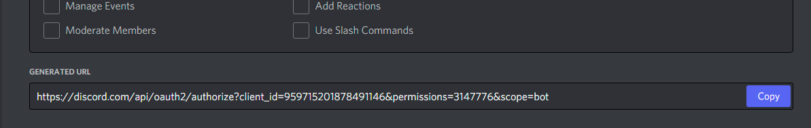

コピーしたURLへブラウザでアクセスし、サーバーを選んでjoinさせます。

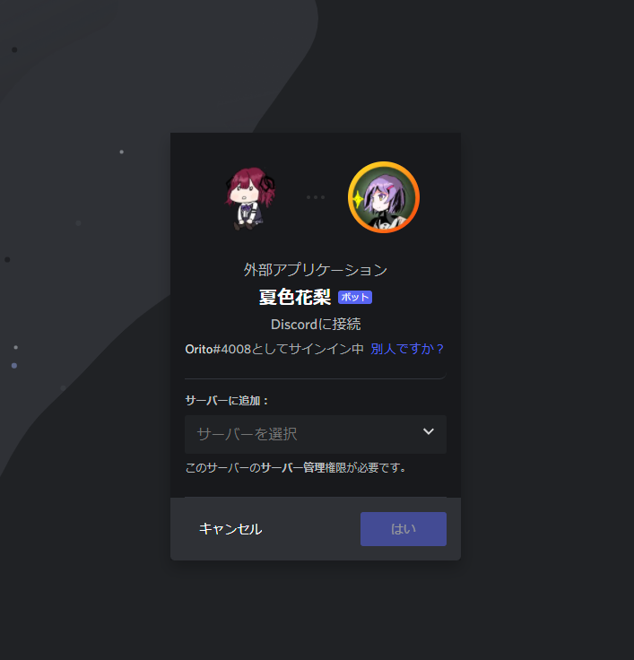
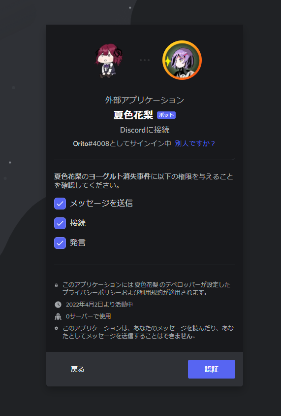

### tokenを取得する

「Bot」から「Reset Token」を選択します。

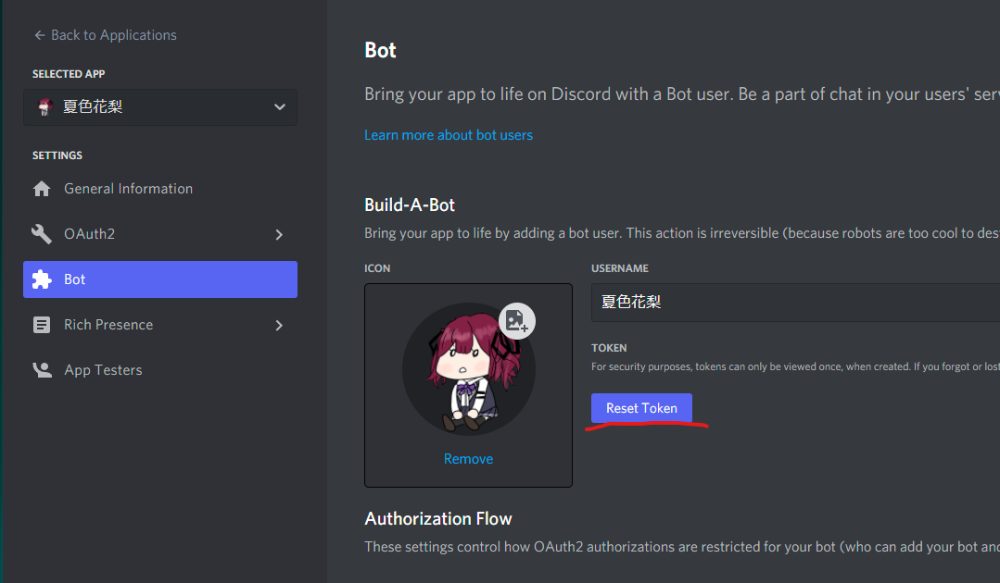

Tokenを「Copy」します。


「karin-token.txt」というファイルをREADME.mdと同じディレクトリに作成し、Tokenの内容をペーストします。

同様にして、Botをもう一つ作成し「rikka-token.txt」というファイルも作成します。

### .NETをインストールする

.NETがインストールされていない場合、.NET Runtimeを次のページからダウンロードし、インストールします。

https://dotnet.microsoft.com/ja-jp/download

### Botを起動する

README.mdと同じディレクトリで次のコマンドを実行します。

```
$ dotnet run
```

プログラムが起動し、CeVIO AIが起動してBotがアクティブになります。

各Botのコマンドについては次のコマンドをDiscordで入力して確認してください。

```
rikka-chan help
```

```
karin-senpai help
```
